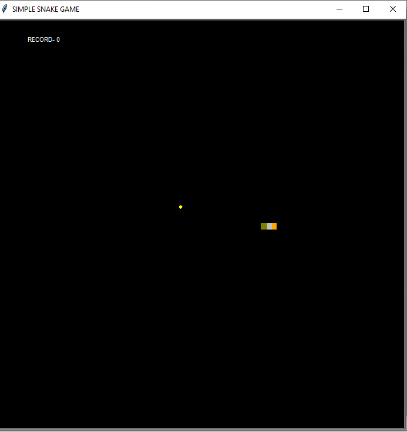

# snake_game
This is a simple snake game built with python using turtle graphics
To show case  
           1. Classes and objects
           2. File handling

           
Use arrow keys to control the snake

Features
 1. Score update
 2. Snake growth
 3. High score displayer

